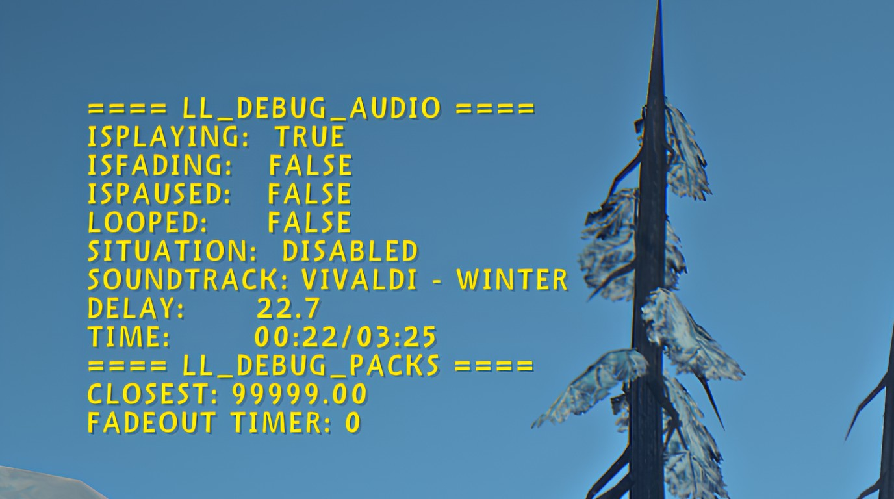

# Debug Output



A MelonLoader utility mod for **The Long Dark** survival mode.

Debug Output is a mod created specifically for mod developers. When I was developing my large mod, I realized that the main problem with developing mods for The Long Dark is debugging. The game runs constantly and has thousands of background processes that are difficult to track. Reading logs and setting breakpoints isn't enough. You need a constant, stable display of information on the screen to monitor what's happening in real time. And debug output became my solution.

It assists in mod debugging by enabling a special debug mode that displays important mod parameters in real time as text or a table. The simplest example is the debug_weather console command, which exists in the vanilla game. Debug Component allows you to register similar commands, taking care of all the registration, support, and display work, eliminating conflicts with other mods and vanilla commands. Furthermore, Debug Component allows you to output multiple data tables at once, mixing them into one, including vanilla ones.

## How-to

### Straightforward usage

The mod's interface is simple and designed to be similar to uConsole's interface while still handling most of the work. The simplest implementation requires adding just a few lines to OnInitializeMelon:

``` C#
DebugManager.RegisterDebugCommand("xyz_debug_something", () => "text output");
```

And xyz is short name of your mod. My Long Largo, for example, names it "ll_debug_audio". You are free to call it whatever you like.

However, this simplicity doesn't mean you should immediately add DebugOutput.dll to your dependencies and use its classes directly. You can, it's not prohibited, and it will work, but I don't consider it a proper implementation.

### Dependencies problem

The thing is, I'm against using dependencies in mods where it's possible to avoid them. A dependency is always a trade-off, and not always a good one. When you add a dependency to your code, you inherit both the mod's benefits and its drawbacks. If the dependency is buggy, your code is buggy. If the dependency has functionality that interferes with yours, you have to accept it. If the dependency is outdated, your mod is outdated. The developer of the dependency has their own perspective on development and their own interests, which don't always align with yours. By adding dependencies to your mod, you enter into this trade-off, and worse, you force the player to enter into this trade-off as well. After all, they won't be able to play your mod without installing the mods you depend on. In this sense, DebugOutput is special because it's designed for you, the developer. Players shouldn't need to debug your mods.

### Optional Dependency

Luckily, I have a solution! It's right here, in the [Examples](https://github.com/Danileros/DebugOutput/blob/main/Examples/DebugManagerProxy.cs) folder. This is a proxy class that loads DebugOutput without requiring you to add this mod to the References list. You don't even need to specify DebugOutput as a dependency—if it's installed in the Mods folder, the debugging functionality will work. If this mod isn't in the Mods folder, no problem—the debugging functionality will simply be disabled. No exceptions will be thrown; the debug command simply won't appear in the console commands list, and the debug output rendering function will never be called. This functionality is reliable and well-optimized.

Simply copy-paste it to your mod and use. Add `public static DebugManagerProxy DebugManager = new();` to your `MelonMod`/`MelonPlugin` class. And the Just use it in a similar way.

``` C#
// Register a command in an OnInitializeMelon or your class contructor, or Awake:
Main.DebugManager.RegisterDebugCommand("xyz_debug_something", Something.DebugData);
```

And it is working! Once you type `xyz_debug_something` into game console, a menu with output will appear the demonstrates text output from Something.DebugData. Remember that Something.DebugData is being invoked at literally every frame, so it must be well-optimized.

If your class object is being destroyed, it means you also need to unregister a command by calling opposite method:

``` C#
// Register a command in an OnDestroy if command is no longer needed:
Main.DebugManager.UnregisterDebugCommand("xyz_debug_something", Something.DebugData);
```

It will automatically disable an output and destroy it.

Although the output is enabled and disabled by a console command, you can also control it from code. Methods `GetDebugEnabled` and `SetDebugEnabled` can be used for this.

As you see, using proxy is as simple as using direct reference. And it is as fast as direct calls.

## Installation

* Common mods installation process is described at [TLD Mods](https://tldmods.net/install.html). Make sure your MelonLoader version matches.
* Download latest mod version from Releases page.
* Drop archive files to Mods folder in The Long Dark game directory.
